# My React Project

This project is built using React and Vite for a fast, modern web development experience.

## Getting Started

Follow these steps to get up and running with the project:

### Prerequisites

- Node.js (version 14 or later)
- npm or Yarn

### Installation

1. **Clone the repository:**

```bash
git clone https://github.com/your-username/your-repo.git
cd your-repo
```


# using npm
npm install

# or using Yarn
yarn install


# using npm
npm run dev

# or using Yarn
yarn dev


There you go! This README should cover the basics to get you started. Anything else you'd like to add or tweak?


here a simple go through of the project

### 1. here you can simply login with admin, client, and employee, teamLead


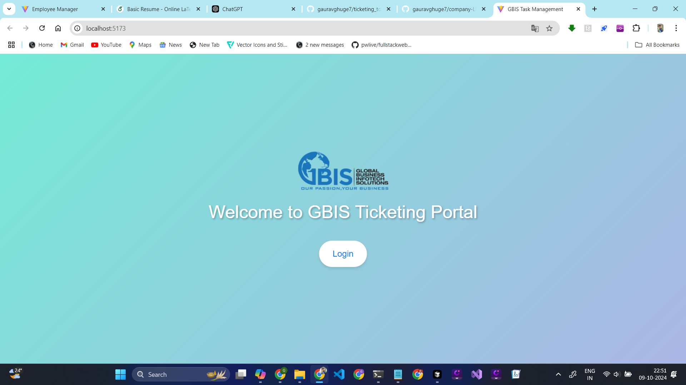


### 2. preview of login page

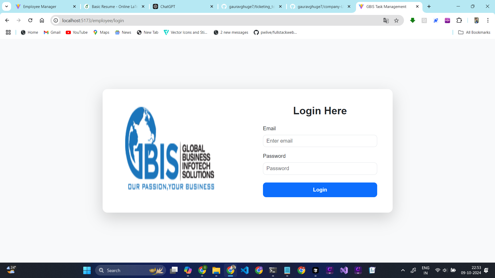


### 3. here is the dashboard page

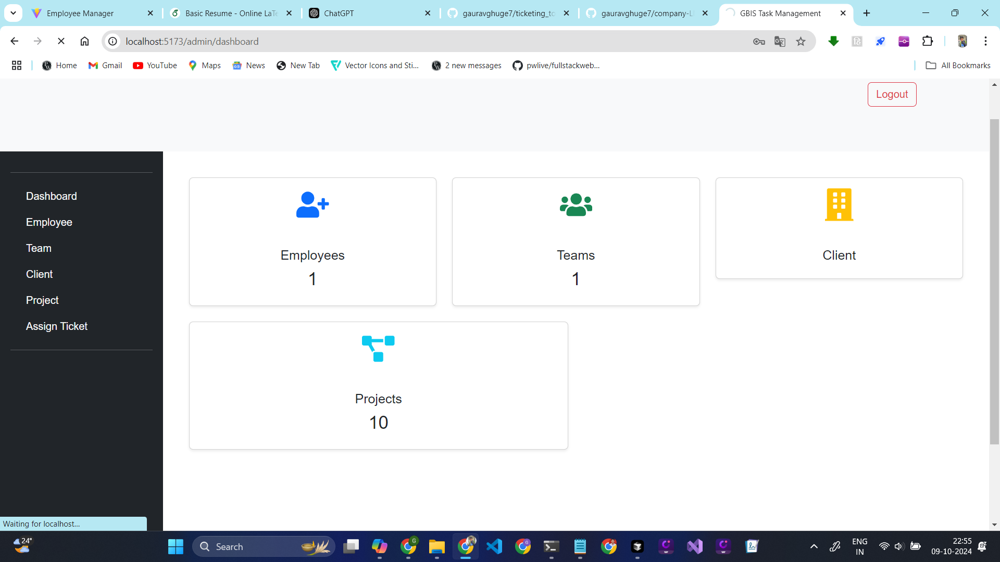


### 4. here is the employee page
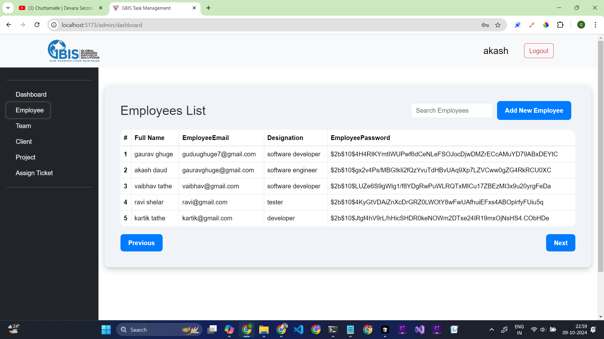


### 5. here is the team page

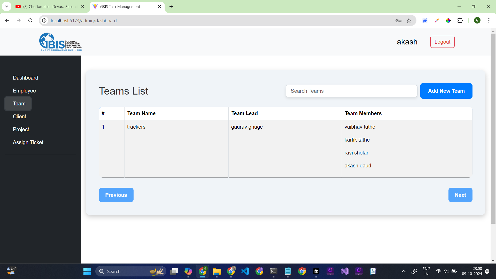

### 6. here is the client page
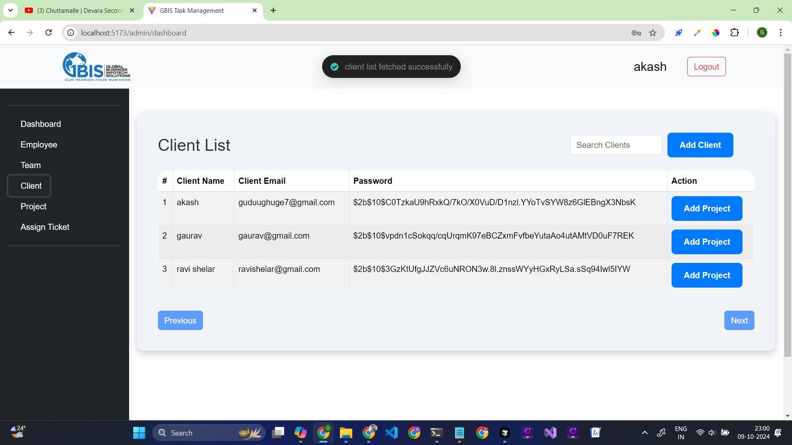

### 7. here you can create a project and add tasks to it

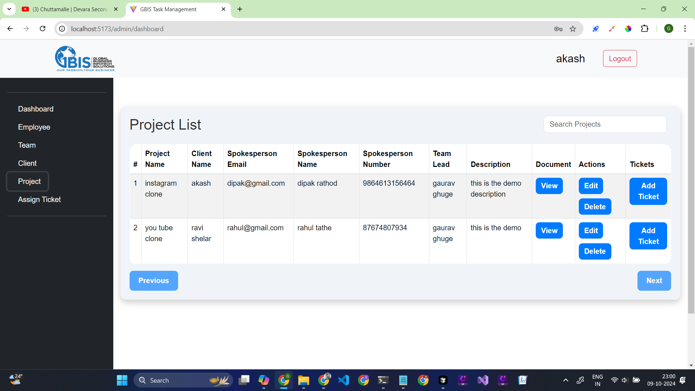


# Now Start the Employee Dashboard

## login page for all users are same


### 1. here can employee view dashboard
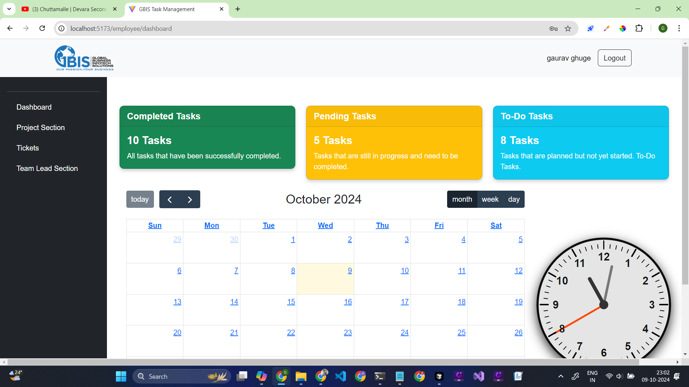

### 2 here have a team lead section for team leaders 

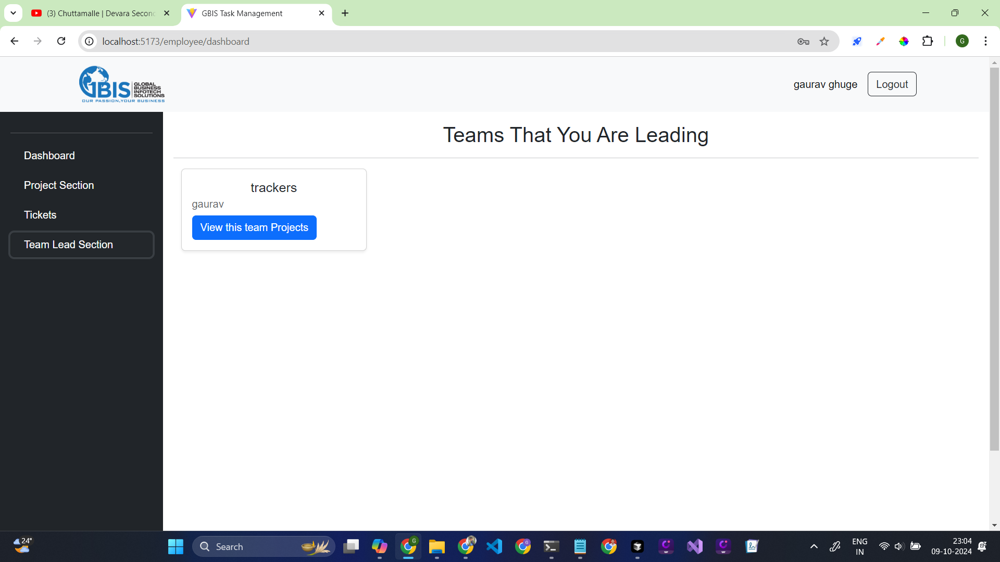

### projects that have leading this team

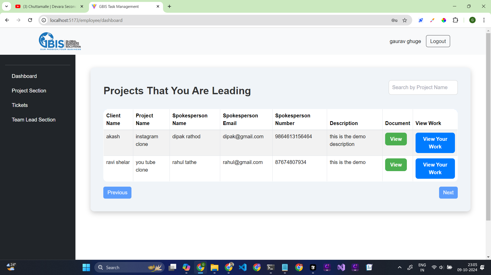

### here have client details for the team leader

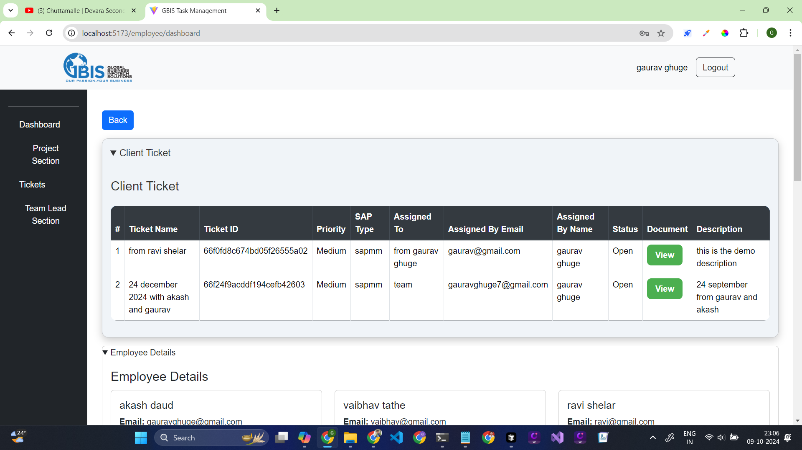

### here have a section for team members

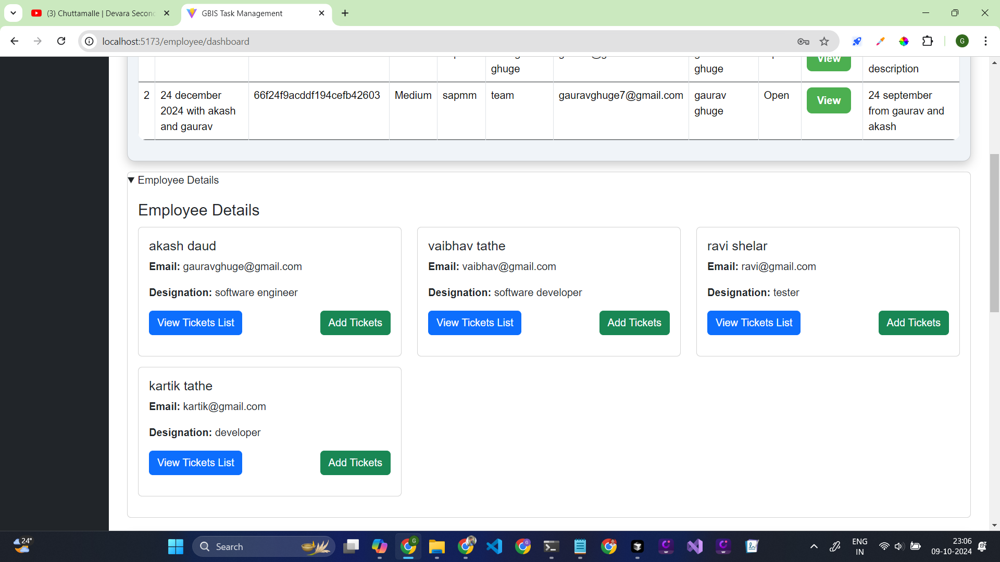


### here have the tickets that assign from the clients and team leaders 

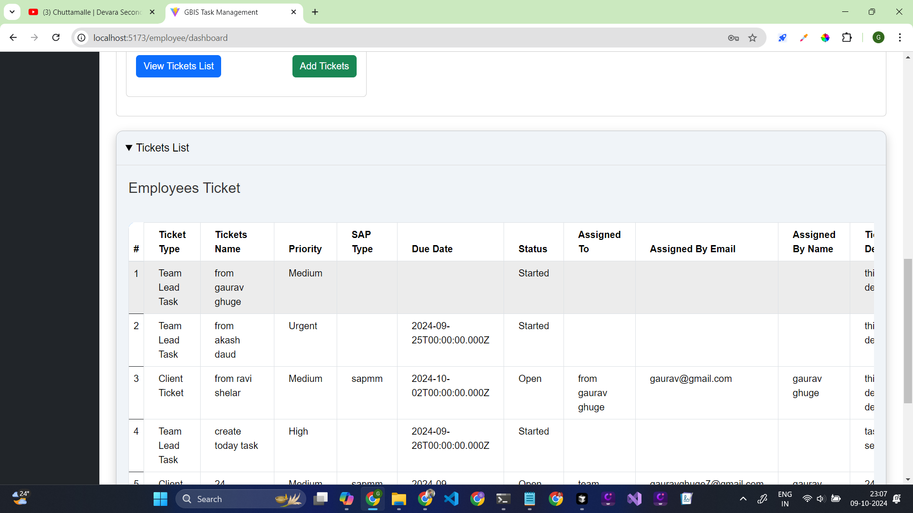


## another one Employee projects and tasks page

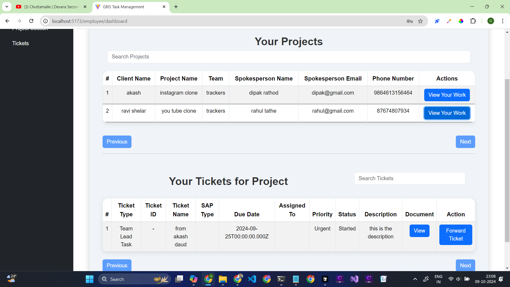

they can complete the work and submit the work to the client

and another one they can foword ticket to another team member 


this is new change from my side 